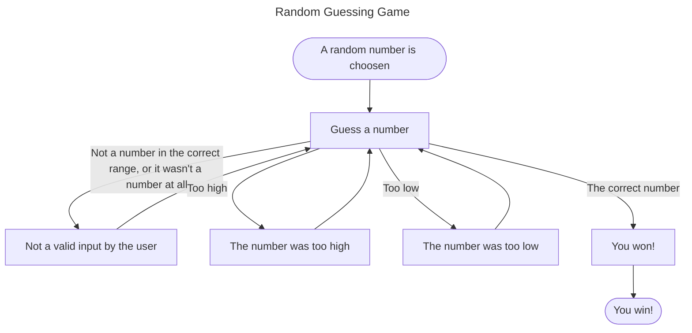

# Random Guessing Game
## Overal all concept:
This game will randomaly select a number within a specific range, and you have to guess what that number is. Depending on your answer it will tell you if you are too high, too low, or you guessed correctly.
## Step-by-step:
1. The program picks a random number within a set range
2. You guess a number
    
    1. You didn't give a numerical answer that was within the correct range
        * The program tells you to guess a **_number_** within the correct range
    2. It was too high
        * The program tells you it was too high, so you go back to step number 2
    3. It was too low
        * The program tells you it was too low, so you go back to step number 2
    4. It was correct
        * Yay! You won the game! So you continue to step number 3
3. The end of the game. You won!